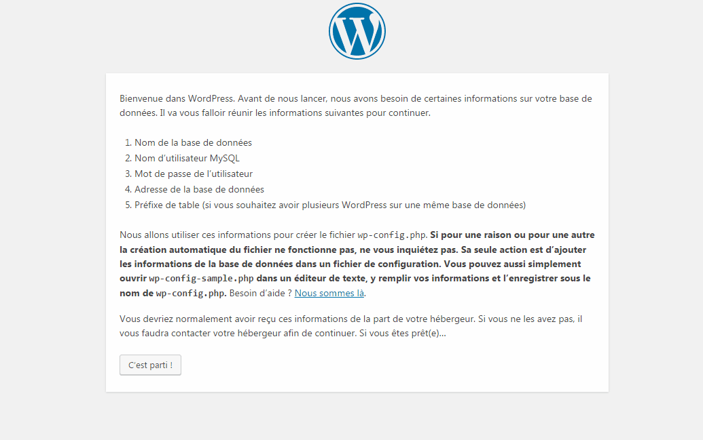

# Installation d'une instance Wordpress

- Téléchargez les fichiers d’installation de WordPress.
- Créez une base de données MySQL.
- Allez sur votre site sur le navigateur suivant votre serveur et exécutez l’assistant d’installation WordPress.

## Étape 1 – Télécharger les fichiers d’installation de WordPress
Tout d’abord, téléchargez la dernière version de WordPress. 
Les fichiers d’installation de WordPress sont compressés dans l’archive .zip. 
Extrayez l’archive dans n’importe quel dossier de votre ordinateur. 
Vous obtiendrez un dossier nommé wordpress. Ce dernier contient les fichiers d’installation WordPress.

## Étape 2 – Créer une base de données MySQL

WordPress génère du contenu de façon dynamique. Notamment à chaque fois que le visiteur arrive sur votre site Web. 
Toutes les informations sont stockées dans une base de données. Ainsi, vous devrez en créer une.

- Nom de la base de données MySQL
- Nom d’utilisateur MySQL
- Mot de passe

>>> IMPORTANT: Assurez-vous d’écrire dans un fichier texte les informations d’identification MySQL – vous en aurez besoin plus tard.

## Étape 3 – Exécutez l’assistant d’installation WordPress 5 minutes

A cette étape, tous les fichiers WordPress devraient être sur le serveur et la base de données MySQL devrait être créée. 
Maintenant, vous pouvez continuer avec l’assistant d’installation. Accédez-y en allant sur votre site à l’aide d’un navigateur Web.

L’assistant d’installation WordPress contient 5 étapes au total:

1. Sélectionnez votre langue et appuyez sur Continuer. (Etape qui n’est pas sur toutes les versions)
2. WordPress va vous demander de donner les informations de connexion à MySQL. Puisque vous les avez déjà, appuyez sur C’est parti !.
3. Sur cet écran entrez vos informations de connexion à la base de données MySQL et le nom d’hôte MySQL. Vous pouvez vérifier quel est votre nom d’hôte sur Hostinger dans la section Bases de données . 
Appuyez sur le bouton Envoyer une fois que vous avez terminé.
4. WordPress vérifiera s’il est possible de se connecter à la base de données MySQL. S’il n’y a pas d’erreurs, appuyez sur Lancer l’installation.
5. À cette étape, entrez les informations sur le site Web et les informations administrateurs et appuyez sur Installer WordPress :
    - Titre du site – Titre de votre site Web.
    - Nom d’utilisateur – Administrateur nom d’utilisateur.
    - Mot de passe – Mot de passe administrateur.
    - Votre mail – Adresse e-mail de l’administrateur.
    - Visibilité des moteurs de recherche – Si vous cochez cette option, WordPress essaiera d’empêcher les moteurs de recherche d’analyser votre site Web.

>>> C’est tout, l’installation de WordPress a été achevée. Appuyez sur le bouton de connexion pour accéder à la zone d’administration WP.